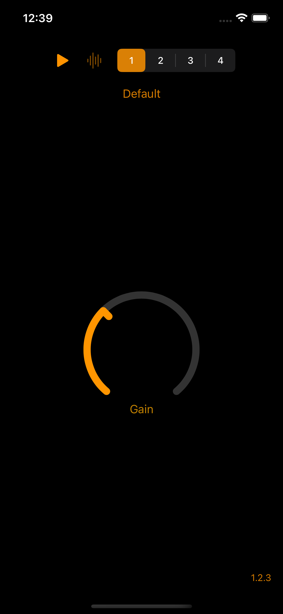

[![CI][status]][ci]
[![COV][cov]][ci]
[![][spiv]][spi]
[![][spip]][spi]
[![License: MIT][mit]][license]

# Overview

Swift package containing useful code for AUv3 app extensions. There are three products in this package:

- [AUv3Shared][s] -- collection of extensions and classes for both AudioUnit components packaged as an AUv3 app
  extension, and the host app that contains them. Because it will be linked to the AUv3 app extension, it must not link
  to or use any APIs that are forbidden by Apple for use by app extensions. This code works on both iOS and macOS
  platforms.
- [AUv3Host][h] -- classes that provide a simple AUv3 hosting environment for the AUv3 app extension. Provides an audio
  chain that sends a sample loop through the AUv3 audio unit and out to the main speaker. The host supports user presets.
- [AUv3Component][c] -- classes specific to an AUv3 component. Foremost is the [AudioUnitAdapter][aua] class that
  provides a generic AUv3 container for a custom DSP kernel that performs the signal processing. Additional Swift types
  provide useful parameter functionality.

Additional AUv3 functionality specific to C++ can be found in the [DSPHeaders][dh] repo. Of particular note is the 
[EventProcessor][ep] template class that provides a complete foundation for a C++ DSP kernel that can be used in Swift and
put in [AudioUnitAdapter][aua] container.

# Demo App

There is a demo app that illustrates how to use the [AUv3Host][h] and [AUv3Component][c] modules. The demo app
essentially replicates what is available in Xcode when you ask it to create a new project from the "Audio Unit Extension
App" template. The app serves as a simple AUv3 host to play audio samples through the AUv3 effect which is just a simple
gain control. There is a circular knob that controls the gain of the effect. The knob comes from my [AUv3Controls][ac]
package, and it is served from the AUv3 component's [SwiftUI view](AUv3Demo/AUv3DemoExtension/UI/AUMainView.swift).

The "play" button starts/stops audio. The button next to it is the _bypass_ that controls whether the effect affects the
audio output. The last control provides quick access to the "factory" presets. This control attempts to mimic Apple's
own segmented control but supports accented coloring (see [the repo][sc] for details). 

Below these controls there is text showing the name of the current preset. Touching that reveals a menu showing all
known presets as well as controls for managing user presets. You can create your own presets, update them with new
values, rename them, and delete them.

The last control is at the lower-right of the screen showing the version of the AUv3 application extension. When
touched, the default behavior is to show the App Store entry for the AUv3 component.

For comparison, below is the view of the same app running on macOS:

## History

This is an update of my [AUv3Support][old] package which used UIKit and AppKit and included the DSPHeaders package. This
new package relies on SwiftUI and the hosting app is much more modularized using [The Composable Architecture][tca]
framework.

Otherwise, the functionality remains pretty much the same between the two packages.

[s]: Sources/AUv3Shared
[h]: Sources/AUv3Host
[c]: Sources/AUv3Component
[dh]: https://github.com/bradhowes/DSPHeaders
[old]: https://github.com/bradhowes/AUv3Support
[tca]: https://github.com/pointfreeco/swift-composable-architecture
[ac]: https://github.com/bradhowes/AUv3Controls
[sc]: https://github.com/bradhowes/brh-segmented-control
[aua]: Sources/AUv3Component/AudioUnitAdapter.swift
[ep]: https://github.com/bradhowes/DSPHeaders/Sources/DSPHeaders/include/DSPHeaders/EventProcessor.hpp

[ci]: https://github.com/bradhowes/auv3-support/actions/workflows/CI.yml
[status]: https://github.com/bradhowes/auv3-support/actions/workflows/CI.yml/badge.svg
[cov]: https://img.shields.io/endpoint?url=https://gist.githubusercontent.com/bradhowes/8a47cae880f266d624470c768706af2c/raw/auv3-support-coverage.json
[spi]: https://swiftpackageindex.com/bradhowes/auv3-support
[spiv]: https://img.shields.io/endpoint?url=https%3A%2F%2Fswiftpackageindex.com%2Fapi%2Fpackages%2Fbradhowes%2Fauv3-support%2Fbadge%3Ftype%3Dswift-versions
[spip]: https://img.shields.io/endpoint?url=https%3A%2F%2Fswiftpackageindex.com%2Fapi%2Fpackages%2Fbradhowes%2Fauv3-support%2Fbadge%3Ftype%3Dplatforms
[mit]: https://img.shields.io/badge/License-MIT-A31F34.svg
[license]: https://opensource.org/licenses/MIT
